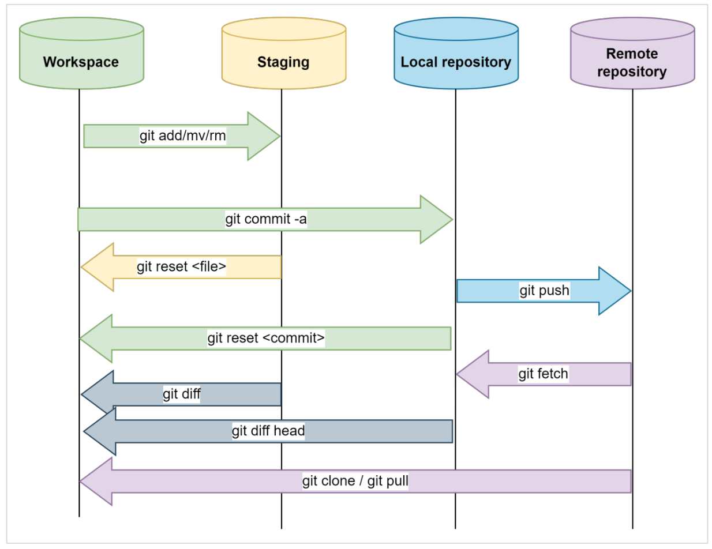
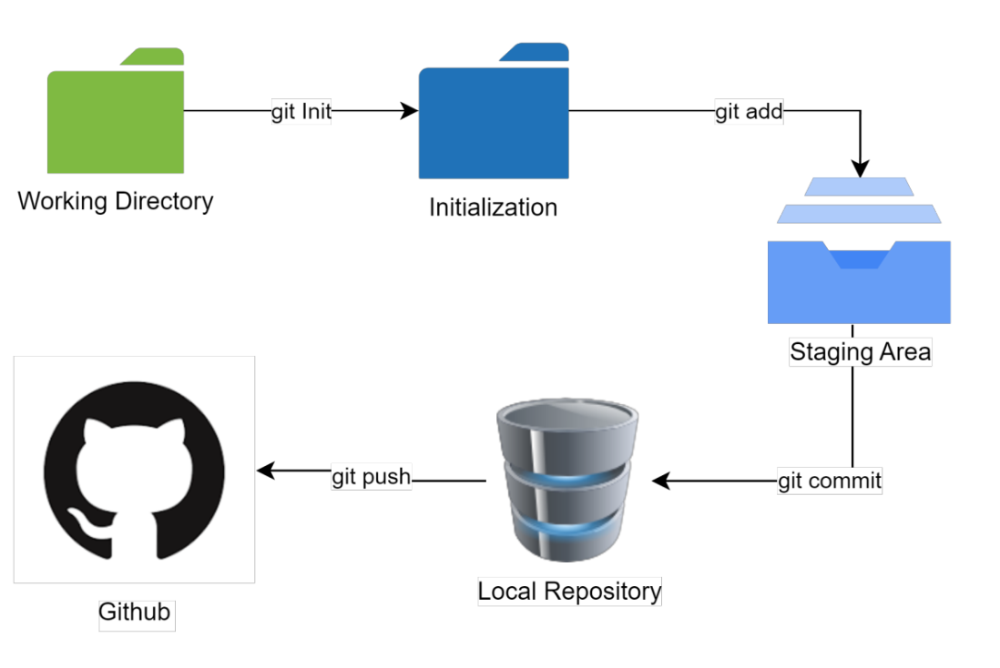
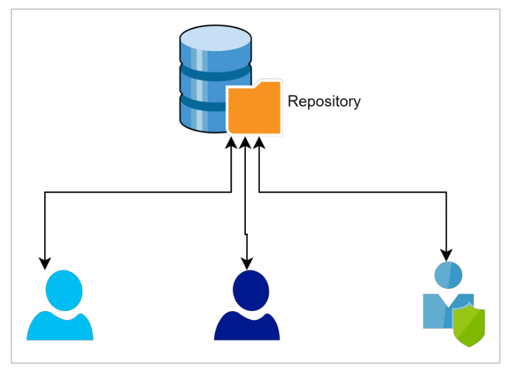
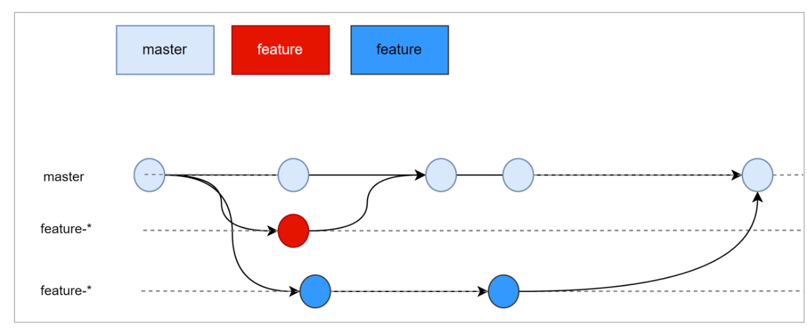
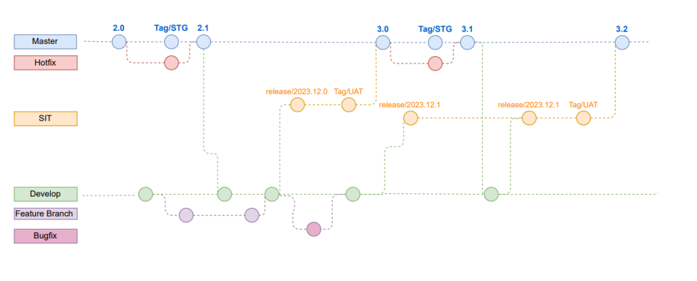
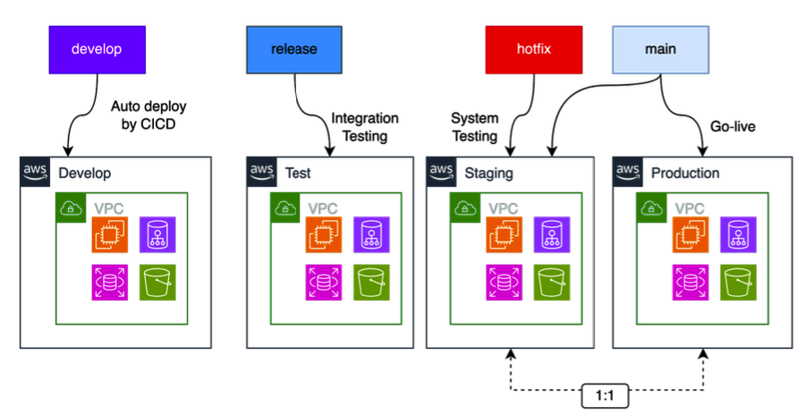

# Git và những thứ liên quan 

## 1. Git và tiểu sử 
Ở chổ này tui hẻm ghi nhiều đâu nhen

=> Nhưng mong đợi ai cũng hiểu chung về chức năng của nó là **quản lý source code**

## 2. Các thành phần và thao tác của git cần nắm

Dưới đây là hình ảnh mô tả git

- GitRepository:

	Nơi lưu trữ code á =)) . Lưu trữ toàn bộ source code , history có thể nằm ở máy local, server hoặc trên cloud.
- Commit :

	Nhiều người hay hỏi " M commit chưa mà nói xong task mậy =)) ". Commit có thể hiểu là 1 mốc mình chốt code của mình và đưa code lên (Văn nói vậy thôi). Hay thầy Linh bảo là ảnh chụp (snapshot) của codebase tại 1 thời điểm cụ thể

- Branch: 

	Nhánh thui 

- Merge:

	Hành động kết hợp 1 branch và branch khác 

- Remote: 

	Đây là cơ chế hay của git như việc copy 1 bản repository nằm trên máy khác. Điều này có thể cho phép nhiều develop phát triển và đồng bộ các thay đỏi giữa các bản sao với nhau . Tránh mất code nữa ^^

- Clone: 

	Hành động tạo bản sao của repo á

- Pull: 

	Thao tác download thay đổi từ 1 remote repository và merge chúng vào local repository

- Push :

	Thao tác upload thay đổi từ local repo lên remote repo

## 3. Vòng đời của Git (Git life cycle)

Hình ảnh vòng đời của git đây nè!

1. Create: Tạo mới repository trên máy
local hoặc trên remote server

2. Modify: add thêm các file code sử dụng các IDE. Git sẽ tự động detect các
thay đổi. 

	=> thật là quyền năng để xác định được code thay đổi những gì 😘
không có git thì mọi thay đổi nhìn bằng mắt ngu người luôn á 😤  

3. Stage: sử dụng *git add command* để chuẩn bị các thay đổi sẽ được commit
vào repository.

4. Commit: Apply các thay đổi vào repository, này là mới apply ở repo local thôi nhé 😉

5. Push: đẩy những thay đổi từ local
repository lên một repository khác (vd
Github, Git server công ty.

## 4. Các mô hình workflow với git

### 4.1 Centralized workflow

*Centralized workflow*: Phù hợp cho những dự án
nhỏ, codebase đơn giản.

Kiểu 1 dev tự clone về xong rồi tự push.

Chớ mô hình ngày thêm *Hái thứ hiêu* vô là xảy ra ra conflict liền. 

khi nhiều người sửa chung 1 module or file sẽ conflict nên chỉ phù hợp với dự án nhỏ thôi

### 4.2 Feature branch Workflow 

Mỗi khi developer phát triển chức
năng mới, họ sẽ tạo một nhánh riêng
từ nhánh chính. Sau khi kết thúc công
việc sẽ tạo pull-request để merge
ngược trở lại.

### 4.3 Gitflow workflow

Phù hợp cho dự án lớn, codebase phức tạp,
có thời gian phát triển dài.

Mô hình này chia branch thành các branch
có nhiệm vụ khác nhau như:

- main
- develop
- feature-*
- bugfix-*
- release-*
- hotfix-*

- main: nhánh chính duy trì xuyên suốt vòng đời
dự án. Chỉ được merge code vào khi có release
lớn hoặc hot-fix. Được đánh tag theo release
version.
- develop: nhánh dùng để các developer phát triển
feature/fix-bug. Code được checkout từ đây và
merge trở lại khi hoàn thành task.
- feature-*: naming rule tuỳ theo dự án. vd
feature-<ticket-id>. Checkout từ nhánh develop.
- bugfix-*: tương tự nhánh feature, dùng để fix
bug.
- release: được tạo ra trước mỗi đợt release
version mới, code thường được deploy lên môi
trường test/staging, có thể thực hiện chỉnh sửa
nhỏ(optional).

Dưới đây là 1 mô hình mình từng triển khai cung team cho dự án ở ngân hàng TCB 
Bạn có thấy các code branch được tách và quản lý chặt chẽ để dự án được phát triển ổn định

## 5 Git và các môi trường trong dự án

Trong quy trình vòng đời phát triển phần mềm thường được chia ra nhiều môi trường để phát triển kiểm thử cà golive tới enduser
-  ít nhất với 3 môi trường DEV, Test, PROD
- Thông dụng nhất là 4 môi trường: Dev, Test, Staging , Prod
- Nhiêu hơn với các môi trường: Dev, SIT, UAT, STG , PT , DR, PROD (😉 mình từng tham gia product của TCB vs 7 môi trường như thế ^^ )

Dưới đây mình sẽ trình bay mô hình thông dụng nhất với 4 môi trường: 
- Môi trường Dev: Thường được deploy auto ngay khi có pull requesst được merge vào nhánh develop (CICD)
- Môi trường Test: sử dụng cho Integration Testing, thường được release theo phuên bản từ nhánh release
- Môi trường Staging: Sử dụng cho System Testing & hoạt động UAT trước khi release cho end-user. Về co bản môi trường Staging phải giống môi trường Production . Vì nếu có lỗi gì trên Prod thì mình cũng sẽ tái hiện được ở môi trường STG này và fix bug nó =)) .
Khi apply Hotfix, nên test trước nới mt Staging trước khi apply merge vào main và deploy lên Production .

