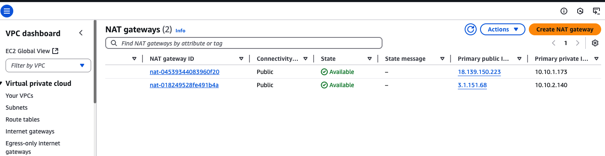
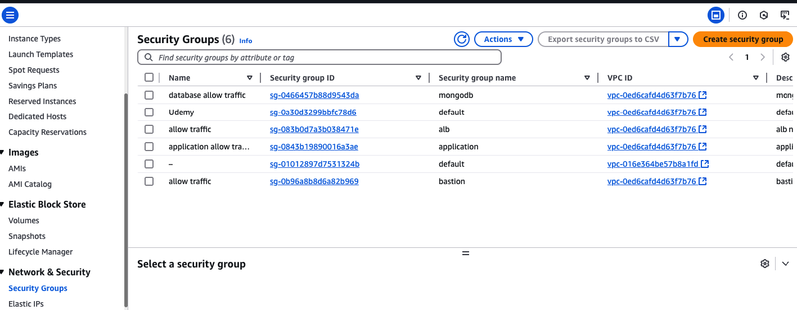
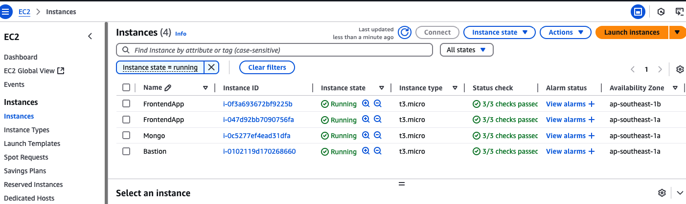
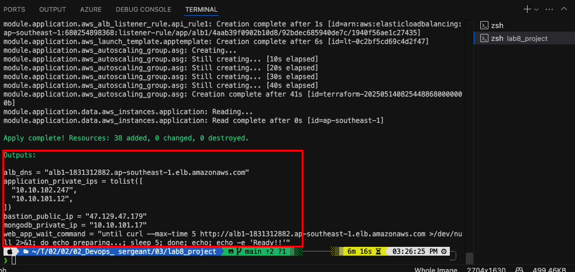
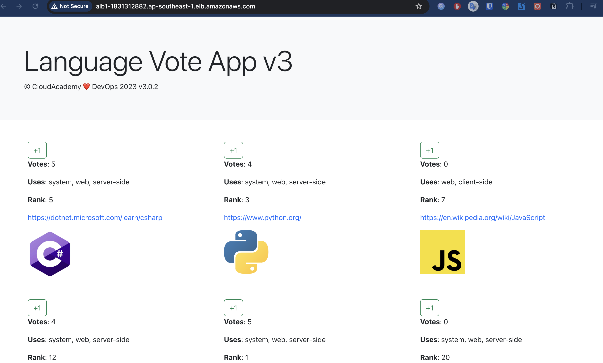

# Dự án Terraform AWS - Multi-Tier Application

## Tổng quan
Dự án này triển khai một ứng dụng web multi-tier trên AWS sử dụng Terraform. Kiến trúc bao gồm các tầng: Bastion Host, Application Load Balancer, Web Server, API Server và MongoDB Database.

## Kiến trúc hệ thống

```
                                    [Internet]
                                         |
                                         |
                                    [ALB (80)]
                                         |
                                         |
                    +-------------------+-------------------+
                    |                   |                   |
              [Web Server]        [Web Server]        [Web Server]
                    |                   |                   |
                    +-------------------+-------------------+
                                         |
                                         |
                                    [API Server]
                                         |
                                         |
                                    [MongoDB]
```

### Các thành phần chính:

1. **Network Layer**
   - VPC với CIDR block tùy chỉnh
   - Public Subnets (2 AZs):
     - 10.10.1.0/24 (AZ1)
     - 10.10.2.0/24 (AZ2)
   - Private Subnets (2 AZs):
     - 10.10.101.0/24 (AZ1)
     - 10.10.102.0/24 (AZ2)
   - NAT Gateway (2 instances):
   
     - Mỗi AZ một NAT Gateway
     - Đặt trong public subnets
     - Cho phép outbound traffic từ private subnets
   - Internet Gateway cho public subnets

2. **Security Layer**
   - Security Groups cho từng thành phần:
     - Bastion Host (SSH từ workstation)
     - ALB (HTTP từ internet)
     - Web Server (HTTP từ ALB)
     - API Server (HTTP từ ALB)
     - MongoDB (MongoDB từ API Server)
	 

3. **Compute Layer**
   - Bastion Host (1 instance):
     - Instance type: t3.micro
     - Public subnet
     - Cho SSH access
   - Auto Scaling Group cho Application Servers:
     - Desired capacity: 2 instances
     - Min size: 2 instances
     - Max size: 4 instances
     - Instance type: t3.micro
     - Private subnets
     - Chạy cả Frontend (React) và Backend (Go)
   - MongoDB Server (1 instance):
     - Instance type: t3.micro
     - Private subnet
     - Database server
   - Application Load Balancer
   

## Cấu trúc thư mục

```
lab8_project/
├── modules/
│   ├── application/     # Web & API servers
│   ├── bastion/        # Bastion host
│   ├── network/        # VPC & networking
│   ├── security/       # Security groups
│   └── storage/        # MongoDB instance
├── keypair/            # SSH key pairs
├── main.tf            # Main configuration
├── variables.tf       # Input variables
├── outputs.tf         # Output values
└── terraform.tfvars   # Variable values
```

## Các Module

### 1. Network Module
- Tạo VPC với public và private subnets
- Cấu hình NAT Gateway và Internet Gateway
- Quản lý routing tables

### 2. Security Module
- Security Groups cho tất cả các thành phần
- Rules cho inbound/outbound traffic
- Integration giữa các security groups

### 3. Application Module
- Auto Scaling Group cho web servers
- Application Load Balancer
- Target Groups cho web và API
- Launch Template với user data

### 4. Bastion Module
- EC2 instance trong public subnet
- Security group cho SSH access
- Key pair management

### 5. Storage Module
- MongoDB instance trong private subnet
- Security group cho database access
- User data script cho MongoDB setup

## Cách sử dụng

1. **Cấu hình ban đầu**
   ```bash
   terraform init
   ```

2. **Kiểm tra cấu hình**
   ```bash
   terraform plan
   ```

3. **Triển khai infrastructure**
   ```bash
   terraform apply
   ```
   

   

4. **Xóa infrastructure**
   ```bash
   terraform destroy
   ```

## Biến số cấu hình

Các biến số chính trong `terraform.tfvars`:
- `availability_zones`: Danh sách AZs
- `cidr_block`: CIDR block cho VPC
- `workstation_ip`: IP của workstation để SSH
- `instance_types`: Loại instance cho các thành phần
- `ami_ids`: AMI IDs cho các instance

## Outputs

Các outputs chính:
- ALB DNS name
- Bastion host public IP
- MongoDB private IP
- VPC ID và subnet IDs

## Lưu ý bảo mật

1. **Key Pairs**
   - Sử dụng key pairs cho SSH access
   - Lưu trữ private keys an toàn

2. **Security Groups**
   - Giới hạn access tối thiểu
   - Sử dụng private subnets cho database
   - Bastion host cho SSH access

3. **Network Security**
   - NAT Gateway cho outbound traffic
   - Private subnets cho sensitive resources
   - Security groups cho mỗi tier

## Best Practices

1. **Code Organization**
   - Sử dụng modules để tái sử dụng code
   - Tách biệt các thành phần theo chức năng
   - Sử dụng variables cho cấu hình

2. **Security**
   - Least privilege principle
   - Private subnets cho sensitive data
   - Security groups cho mỗi tier

3. **Scalability**
   - Auto Scaling Groups
   - Load Balancer
   - Multi-AZ deployment

4. **Maintenance**
   - Version control
   - Documentation
   - Regular updates 